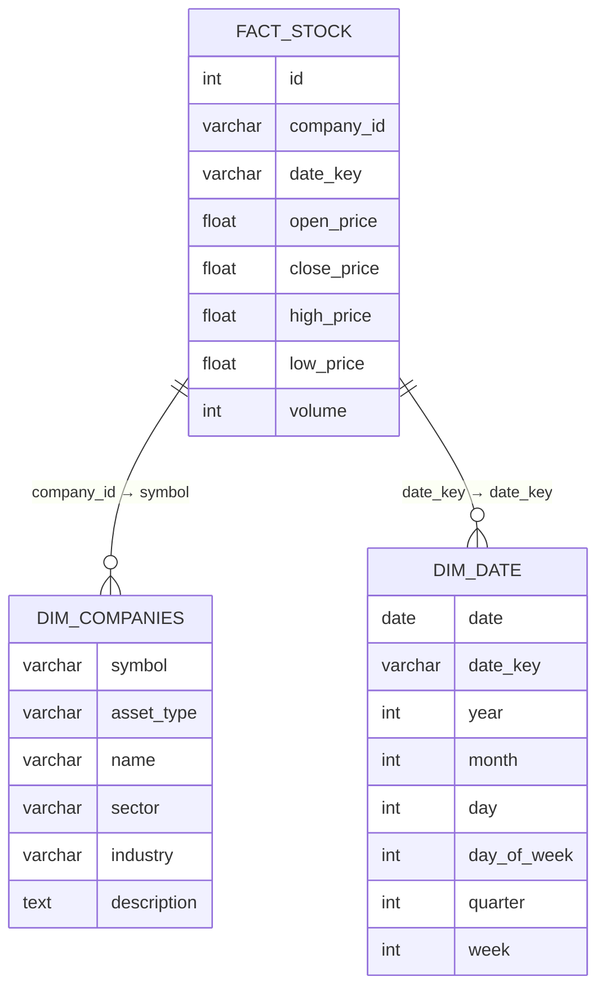

# End-to-End-Streaming-Data-Pipeline

## Table of Contents 
- [Introduction](#introduction)
- [Tech Stack & Tools](#tech-stack--tools)
- [Assumptions](#assumptions)
- [Pipeline Architecture](#pipeline-architecture)
- [DBT Models](#DBT-Models)
- [Airflow DAG Overview](#airflow-dag-overview)
- [Data Warehouse Model](#data-warehouse-model)
- [Data Lineage](#data-lineage)
- [Reporting](#reporting)

## Introduction 
This project is designed to process stock market data in real-time, enabling analytics and insights for financial applications.

## Tech Stack & Tools
- **DBT (Data Build Tool)**: For 	Building business  data models.
- **Spark**: 	Cleans, enriches, aggregates the raw data (heavy lifting)..
- **Snowflake**: As the data warehouse.
- **Docker**: To containerize and standardize the development environment.
- **HDFS**: Raw data landing zone.
- **Python**: For scripting and automation.
- **Airflow** : For orchestrating ETL workflows.
- **Power BI** : For visualizing the reporting layer.

## Assumptions
Environment Setup: Docker and Docker Compose are installed and configured on the host machine.
Kafka: The Kafka topic (stock-prices) is pre-created and ready to receive data from producers.
HDFS: The HDFS_BRONZE_DIR and HDFS_SILVER_DIR directories are used for storing raw and processed data
Spark :  is configured to connect to the HDFS cluster and process data stored in the bronze layer.

## Pipeline Architecture

The project follows the Medallion Architecture, which organizes data into three layers:

    Bronze Layer (Raw Data): Stores unprocessed and ingested data from various sources.
    Silver Layer (Cleansed Data): Cleans and pre-processes data for transformation and enrichment.
    Gold Layer (Aggregated Data): Optimized for analytics, reporting, and business intelligence.

## Airflow DAG Overview

Kafka_Producer: Runs a Kafka producer script to send stock market data to the Kafka topic (stock-prices).
Kafka_Consumer: Runs a Kafka consumer script to consume messages from the Kafka topic and save them to the local warehouse.
Upload_to_HDFS: Uploads the locally saved data to the bronze layer in HDFS.
Spark_Cleaning_Job: Executes a Spark job to clean and transform the data from the bronze layer to the silver layer.
Upload_to_Snowflake: Removes old data and uploads the cleaned data from the silver layer to Snowflake.
build_Models: Runs dbt to build analytical models using the data in Snowflake.
quality_Models_test: Runs dbt tests to validate the quality of the built models.

Kafka_Producer >> Kafka_Consumer >> Upload_to_HDFS >> Spark_Cleaning_Job >> Upload_to_Snowflake >> build_Models >> quality_Models_test

see DAG : [airflow DAG](https://github.com/MAHMOUDMAMDOH8/End-to-End-Streaming-Data-Pipeline/blob/main/dags/Streaming-Data-Pipeline.py)

## DBT Models
#### dim_date

    {{
        config(
            target_schema='gold'
        )
    }}
    
    with formatted_stock_prices as (
        select 
            to_timestamp(timestamp, 'DD-MM-YYYY HH24:MI') as formatted_timestamp
        from {{ source('row_data', 'stock_prices') }}
        where timestamp is not null
    ),
    
    Dim_date as (
        select 
            distinct
            formatted_timestamp as date,
            md5(formatted_timestamp::varchar) as date_key,
            date_part('year', formatted_timestamp) as year, 
            date_part('month', formatted_timestamp) as month,
            date_part('day', formatted_timestamp) as day,
            date_part('dayofweek', formatted_timestamp) as day_of_week,
            date_part('quarter', formatted_timestamp) as quarter,
            date_part('week', formatted_timestamp) as week
        from formatted_stock_prices
    )
    select * from Dim_date

#### Fact_stok 
    {{
        config(
            target_schema='gold'
        )
    }}
    
    with formatted_stock_prices as (
        select
            *,
            to_timestamp(timestamp, 'DD-MM-YYYY HH24:MI') as formatted_timestamp
        from {{ source('row_data', 'stock_prices') }}
    ),
    Fact_Stock as (
        select 
            row_number() over (partition by formatted_timestamp, companies.symbol order by formatted_timestamp) as id,
            companies.symbol as company_id,
            date.date_key as date_key,
            stock_prices.open as open_price,
            stock_prices.close as close_price,
            stock_prices.high as high_price,
            stock_prices.low as low_price,
            stock_prices.volume as volume
        from formatted_stock_prices as stock_prices
        join {{ ref('Dim_companies') }} as companies
            on stock_prices.symbol = companies.symbol
        join {{ ref('Dim_date') }} as date
            on stock_prices.formatted_timestamp = date.date
    )
    
    select *
    from Fact_Stock

see more : [DBT Models](https://github.com/MAHMOUDMAMDOH8/End-to-End-Streaming-Data-Pipeline/tree/main/dbt/Stock/models)

## Data Warehouse Model

## Data Lineage 

## Reporting

# Contact Information
📧 Email: [mahmoud.mamdoh0812@gmail.com](mailto:mahmoud.mamdoh0812@gmail.com)  
🔗 LinkedIn: [Mahmoud Mamdoh](https://www.linkedin.com/in/mahmoud-mamdoh-47a68a203/)  
🐦 Twitter: [@M7M0UD_D](https://x.com/M7M0UD_D)

For any queries, feel free to reach out!

